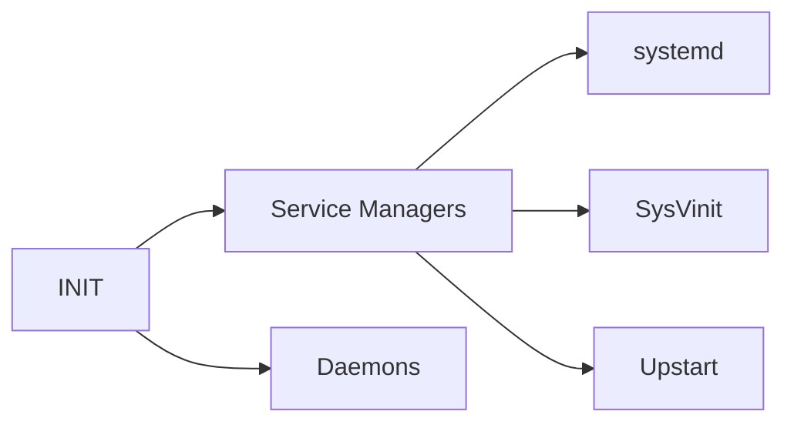

# **System Architecture**

System architecture is a conceptual model that defines the structure, behavior, and various views of a system. This presentation is divided into **three** main topics:

1. Determining and configuring hardware settings.
2. Booting the system.
3. Changing runlevels/boot targets and shutting down or rebooting the system.

---

## **Determining and Configuring Hardware Settings**

### **Device Activation**

Device activation is the process of making hardware devices available for use by the operating system (OS) and user applications. Once devices are correctly identified, the OS associates the corresponding software components required to operate them.

#### **BIOS Settings**

The BIOS (Basic Input/Output System) is responsible for identifying, configuring, testing, and connecting computer hardware immediately after the computer is powered on.  

- **Accessing BIOS**: Press **F2** or **F12** during startup.  
- **Functionality**: Enables/disables integrated peripherals and changes hardware settings.

---

### **Device Inspection**

Devices are inspected using the following commands:  

- **`lspci`**: Displays devices connected to the PCI (Peripheral Component Interconnect) bus.  
- **`lsusb`**: Lists USB (Universal Serial Bus) devices connected to the machine.  

Hardware devices identified by the OS require **kernel modules** (software components) to function fully.  

#### **Kernel Module Commands**  

- **`lsmod`**: Displays all loaded kernel modules.  
- **`modprobe`**: Loads or unloads kernel modules.  
- **`/etc/modprobe.d/blacklist.conf`**: Used to prevent specific modules from loading.  

#### **System Files for Hardware Information**  

- **`/proc/cpuinfo`**: Provides detailed information about the CPU.  
- **`/sys`**: Stores device information and kernel-related hardware data.  

---

### **Storage Devices**

In Linux, storage devices are referred to as **block devices** because data is read and written in blocks of buffered data with varying sizes and positions.

---

## **Booting the System**

### **BIOS or UEFI**

#### **BIOS (Basic Input/Output System)**  

- **Function**: A program stored in non-volatile memory on the motherboard, executed at startup.  
- **Boot Process**:  
  1. **POST (Power-On Self-Test)**: Identifies hardware failures.  
  2. **Activation**: Enables basic components (e.g., video output, keyboard, storage).  
  3. **Bootloader**: Loads the first stage of the bootloader from the MBR (Master Boot Record).  
  4. **Kernel Loading**: The bootloader loads the kernel to start the OS.  

#### **UEFI (Unified Extensible Firmware Interface)**  

- **Function**: A modern replacement for BIOS, offering extensibility and support for larger storage devices.  
- **Boot Process**:  
  1. **POST**: Identifies hardware failures.  
  2. **Activation**: Enables basic components.  
  3. **EFI Application**: Executes pre-defined EFI applications (e.g., bootloaders) stored in the ESP (EFI System Partition).  
  4. **Kernel Loading**: The bootloader loads the kernel to start the OS.  

#### **Differences Between BIOS and UEFI**  

| **Feature**          | **BIOS**                     | **UEFI**                     |  
|-----------------------|------------------------------|------------------------------|  
| **Partition Table**   | MBR (Master Boot Record)     | GPT (GUID Partition Table)   |  
| **Extensibility**     | Not extensible              | Extensible                   |  
| **Max Partitions**    | 4                           | 128                          |  

---

### **The Bootloader**

The most popular bootloader for Linux is **GRUB (Grand Unified Bootloader)**.  

#### **GRUB Features**  

- Displays a list of installed operating systems.  
- Allows passing kernel parameters (e.g., `acpi`, `init`, `systemd.unit`, `mem`, `root`).  

---

### **System Initialization**

- **Initramfs**: An archive containing a filesystem mounted by the kernel during the boot process.  
- **Service Managers**:  
  - **systemd**: Modern init system with parallel service startup.  
  - **SysVinit**: Traditional init system using runlevels.  
  - **Upstart**: Speeds up boot by parallelizing service loading.  

#### **Initialization Inspection**  

- **Kernel Ring Buffer**: Stores kernel messages, including boot messages.  
- **`dmesg`**: Displays current messages in the kernel ring buffer.  

---

## **Changing Runlevels/Boot Targets and Shutting Down or Rebooting the System**

### **SysVinit**

SysVinit uses **runlevels** to define system states:  

| **Runlevel** | **Description**                          |  
|--------------|------------------------------------------|  
| 0            | Halt the system                          |  
| 1            | Single-user mode (maintenance)           |  
| 2            | Multi-user mode without networking       |  
| 3            | Full multi-user mode (with networking)   |  
| 4            | User-definable                           |  
| 5            | Multi-user mode with graphical interface |  
| 6            | Reboot the system                        |  

#### **Commands**  

- **`/sbin/init`**: Manages runlevels and associated daemons.  
- **`/etc/inittab`**: Defines the default runlevel.  
- **`telinit`**: Switches between runlevels.  
- **`runlevel`**: Displays the current runlevel.  

---

### **Systemd**

Systemd is a modern init system used by many Linux distributions.  

#### **Key Features**  

- **Unit Files**: Define service behavior (located in `/etc/systemd/system/` and `/lib/systemd/system/`).  
- **Targets**: Replace runlevels (e.g., `multi-user.target`, `graphical.target`).  
- **Parallel Startup**: Speeds up boot by starting services in parallel.  

#### **Commands**  

- **`systemctl`**: Controls system units.  
  - `systemctl start unit.service`: Starts a unit.  
  - `systemctl stop unit.service`: Stops a unit.  
  - `systemctl restart unit.service`: Restarts a unit.  
  - `systemctl status unit.service`: Displays the state of a unit.  

---

### **Shutdown and Restart**

- **`shutdown`**: Shuts down or reboots the system.  
  - Notifies logged-in users and prevents new logins.  
  - Sends `SIGTERM` and `SIGKILL` signals to processes.  
  - Defaults to single-user mode if no options are specified.  

---
